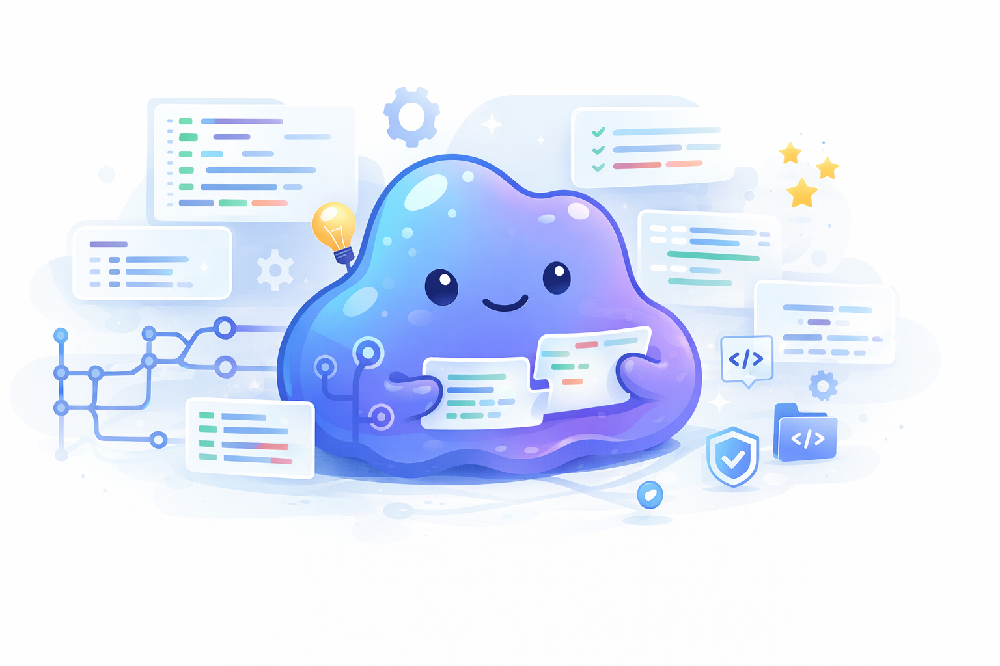

# Ditto Skill 🧬

[中文](./README.md)

<p align="center">
  
</p>

<p align="center">
  <strong>Distill a software repository's git evolution into reusable skills for coding assistants.</strong><br>
  <em>Let your AI coding assistant clone the evolutionary DNA of any repository.</em>
</p>

<p align="center">
  <a href="./LICENSE"></a>
  <a href="https://github.com/Lhy723/ditto-skill/pulls"></a>
</p>

## What is Ditto Skill?

Ditto Skill is a "repository distillation" skill package designed for AI coding assistants such as **Claude Code, Cursor, and Codex**.

Like Ditto in Pokemon, which can copy another creature's abilities at a glance, Ditto Skill does more than show an assistant **what a great repository looks like today**. It dives into the Git history and teaches the assistant **how that repository evolved into its current form**.

It extracts:
- 📦 **Stack adoption order**: when a dependency was introduced and what problem it solved
- 🏗️ **Architecture evolution**: how the directory layout and module boundaries changed as complexity grew
- ✍️ **Engineering habits and muscle memory**: naming, error handling, state management, and implementation style
- 🕳️ **Real pitfalls and fixes**: anti-patterns inferred from `fix` and `revert` commits

It then distills those lessons into a reusable `Master Skill` plus multiple `Subskills`.

---

## 💡 Why does this matter?

Most AI coding assistants can observe the final state of a codebase, but they usually lack a sense of **evolution**. The real value of a strong open-source repository is often hidden in how it changed over time.

❌ **Traditional AI coding (snapshot mode):**  
Copy from the final code state. The assistant can imitate the surface, but not the reasons behind the architecture, nor which mechanisms were patched in later.

✅ **Ditto Skill (evolution mode):**  
Distill experience from repository evolution. When the assistant works on a similar project, it no longer copies code mechanically. It reuses an engineering path that has already been tested in practice.

---

## 🚀 How to use

You do not need to run complex commands manually. Just invoke it in natural language inside your AI coding assistant, such as Claude Code:

> **💬 You can say things like:**
> - *"Use ditto-skill to analyze the current repository and extract its engineering conventions."*
> - *"Use ditto-skill to analyze the evolution history of this GitHub repository."*
> - *"Based on the previous analysis, generate a skill package for me."*
> - *"Use ditto-skill to fully distill this repository, then use the extracted skills to help me start a new project."*

**Default workflow:**
1. 🔍 **Deep analysis**: the assistant analyzes the repository's Git history.
2. 📝 **Return insights**: it reports concise conclusions and writes analysis artifacts.
3. 🧬 **Skill synthesis**: you decide whether to turn those conclusions into reusable skill files, or explicitly ask for one-shot distillation.

---

## How does it work?

Ditto Skill uses a **scripts-first** architecture. Its execution layer is designed for assistants to call reliably inside a skill workflow, without human manual orchestration:

- `scripts/analyze_repo.py` — filters noise and extracts milestone commits from Git history
- `scripts/review_milestones.py` — reviews architectural changes and refactor logic
- `scripts/synthesize_skill.py` — turns insights into highly structured skill markdown
- `scripts/full_distill.py` — runs the full distillation pipeline in one shot

---

## Repository structure

```text
ditto-skill/
├── SKILL.md
├── README.md
├── README.en.md
├── LICENSE
├── agents/
│   └── openai.yaml                       # UI-facing metadata for the skill
├── scripts/
│   ├── analyze_repo.py                   # Analyzes repo structure and Git history, then writes analysis artifacts
│   ├── review_milestones.py              # Reviews milestone candidates and writes review prompts/results
│   ├── synthesize_skill.py               # Generates the master skill and subskills from analysis outputs
│   ├── full_distill.py                   # Runs the full distillation pipeline in one shot
│   └── common.py                         # Shared helpers for paths, JSON I/O, and git subprocess calls
├── references/
│   ├── artifact-schema.md                # Structural contract for analysis artifacts and skill outputs
│   ├── milestone-rubric.md               # Criteria for deciding which commits are true milestones
│   ├── profile-general.md                # Distillation focus for general repositories
│   ├── profile-web-saas.md               # Distillation focus for web SaaS repositories
│   ├── profile-ai-agent.md               # Distillation focus for AI agent repositories
│   └── skill-package-template.md         # Template used when generating master skill and subskills
└── assets/
    └── banner.png
```

---

## Star History

<a href="https://www.star-history.com/?type=date&repos=Lhy723%2Fditto-skill">
 <picture>
   <source media="(prefers-color-scheme: dark)" srcset="https://api.star-history.com/chart?repos=Lhy723/ditto-skill&type=date&theme=dark&legend=top-left" />
   <source media="(prefers-color-scheme: light)" srcset="https://api.star-history.com/chart?repos=Lhy723/ditto-skill&type=date&legend=top-left" />
   
 </picture>
</a>

---

## License

This project is open-sourced under the [MIT License](./LICENSE).
